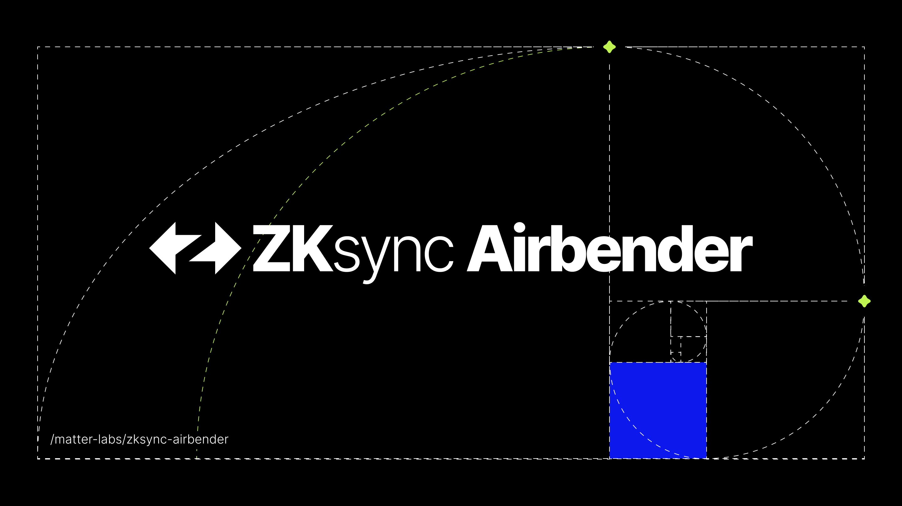

# ZKsync Airbender

This repository contains the RISC-V compilation and proving tools for the ZKsync project, including implementations of RISC-V circuits, a RISC-V simulator, and utilities for witness generation, proof creation, and verification.

## Documentation

The most recent documentation can be found here:

- [In-repo docs](./docs/README.md)
  - [RISC-V Prover - Tutorial](./docs/tutorial.md)
  - [Philosophy and logic](./docs/philosophy_and_logic.md)
  - [Subarguments used](./docs/subarguments_used.md)
  - [Code Repository Layout](./docs/repo_layout.md)

## How to run it

- [RISC-V Prover - Tutorial](./docs/tutorial.md)
- [Running end to end](./docs/end_to_end.md)
- [CLI tool](./tools/cli/README.md)
- [Examples](./examples/)

## Policies

- [Security policy](SECURITY.md)
- [Contribution policy](CONTRIBUTING.md)

## License

Licensed under either of

 * Apache License, Version 2.0, ([LICENSE-APACHE](LICENSE-APACHE) or http://www.apache.org/licenses/LICENSE-2.0)
 * MIT license ([LICENSE-MIT](LICENSE-MIT) or http://opensource.org/licenses/MIT)

at your option.

## Acknowledgements

Details on third-party notices can be found in [NOTICE.md](./NOTICE.md), in `ACKNOWLEDGEMENTS.md` files within the crates, and in comments throughout the code.

## Official Links

- [Website](https://zksync.io/)
- [GitHub](https://github.com/matter-labs)
- [ZK Credo](https://github.com/zksync/credo)
- [Twitter](https://twitter.com/zksync)
- [Twitter for Developers](https://twitter.com/zkSyncDevs)
- [Discord](https://join.zksync.dev/)
- [Mirror](https://zksync.mirror.xyz/)
- [Youtube](https://www.youtube.com/@zkSync-era)

## Contribution

Unless you explicitly state otherwise, any contribution intentionally
submitted for inclusion in the work by you, as defined in the Apache-2.0
license, shall be dual licensed as above, without any additional terms or
conditions.